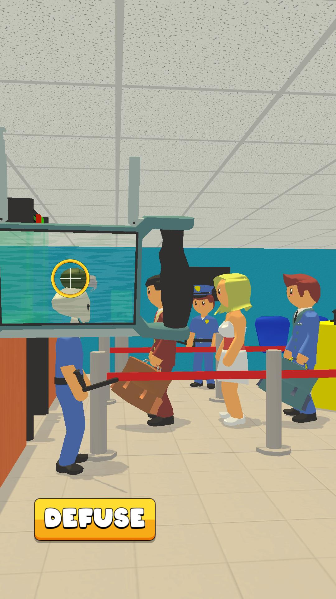

# Sapper-Simulator--code-
 ## code-only

Проект, над которым я работал в [Black Games](https://github.com/blackgames-space) (https://blackgames.space/).

Особенность проекта: использование стенсил буффера. Основной шшейдер - [изменённый TCP2 Hybrid 2 шейдер](Rendering/TCP2%20Hybrid%20Shader%202%20w%20Stencil.tcp2shader) и [шейдер для маски](Rendering/Stencil%20Mask%20Shader.shader)

Геймдизайн и визуальный дизайн от людей из [Black Games](https://github.com/blackgames-space) (https://blackgames.space/), код и разработка мои.

Использует SDK: FacebookSDK, GameAnalytics.

---

Project i worked on @ [Black Games](https://github.com/blackgames-space) (https://blackgames.space/).

Project's feature: usage of stencil buffer. Main shader is [modified TCP2 Hybrid 2 shader](Rendering/TCP2%20Hybrid%20Shader%202%20w%20Stencil.tcp2shader) and [shader for a mask](Rendering/Stencil%20Mask%20Shader.shader)

Gamedesign and visual design form folks @ [Black Games](https://github.com/blackgames-space) (https://blackgames.space/), coding done by me.

Used SDKs: FacebookSDK, GameAnalytics.

---

Preview: 

https://youtu.be/4NcBfHhvwEs

